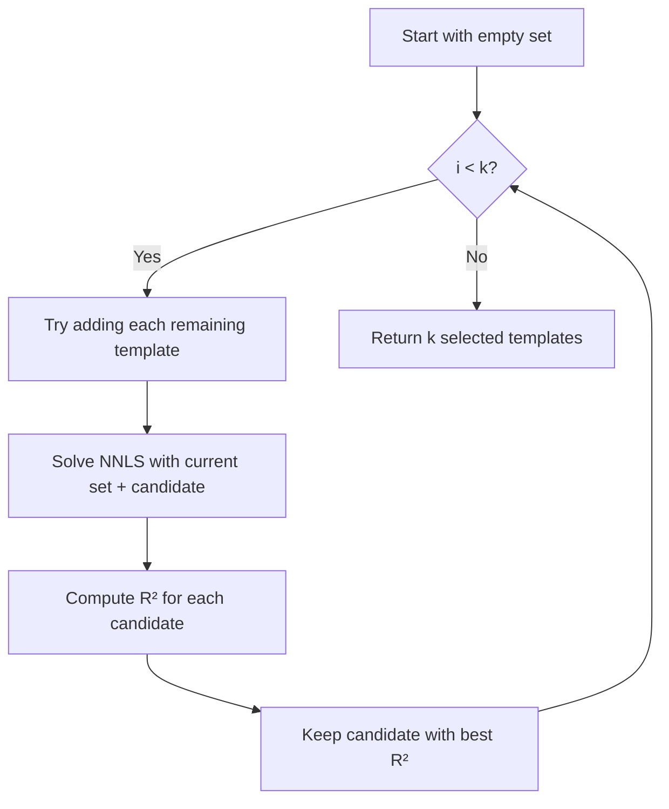

# Implement Greedy Forward Selection for Strategy Selection

## Problem Recap

The current approach selects strategies by taking the top-k highest-weighted templates from the full NNLS solution. This fails because:

- A 66-strategy solution uses many narrow overlapping templates
- The top-3 by weight are narrow (width=7) curves that can't approximate a wide Gaussian
- Result: R² = -1.9 (catastrophic)

## Solution: Greedy Forward Selection

Instead of selecting based on weights from a different solution, iteratively build the k-strategy set by always adding the template that most improves the current approximation.



## Implementation

### Location

[src/python/templates.py](src/python/templates.py) - Add new selection function and modify `approximate_nnls()`

### New Function: `greedy_select_templates()`

```python
def greedy_select_templates(target, templates, k):
    """
    Greedily select k templates that best approximate target.
    
    At each step, adds the template that most improves R².
    """
    n_templates = len(templates)
    selected_idx = []
    remaining_idx = set(range(n_templates))
    
    for _ in range(k):
        best_r2 = -np.inf
        best_idx = None
        
        for idx in remaining_idx:
            # Try adding this template
            trial_idx = selected_idx + [idx]
            trial_templates = templates[trial_idx]
            
            # Solve NNLS with trial set
            weights, _ = nnls(trial_templates.T, target)
            approx = trial_templates.T @ weights
            
            # Normalize and compute R²
            if np.sum(weights) > 1e-12:
                approx = approx * (np.sum(target) / np.sum(approx))
            r2 = _compute_r_squared(target, approx)
            
            if r2 > best_r2:
                best_r2 = r2
                best_idx = idx
        
        selected_idx.append(best_idx)
        remaining_idx.remove(best_idx)
    
    return selected_idx
```

### Modify `approximate_nnls()`

Replace the top-k selection block (lines ~108-135) with:

```python
if max_strategies is not None and len(nonzero) > max_strategies:
    truncated = True
    
    # Use greedy forward selection instead of top-k by weight
    top_k_idx = np.array(greedy_select_templates(target, templates, max_strategies))
    
    # Re-solve NNLS with selected templates (same as before)
    reduced_templates = templates[top_k_idx]
    reduced_weights, _ = nnls(reduced_templates.T, target)
    
    # Map back to full weight vector
    weights = np.zeros(len(templates))
    weights[top_k_idx] = reduced_weights
    nonzero = top_k_idx[reduced_weights > 1e-6]
```

## Expected Improvement

For the Gaussian target (sigma=12):

- **Before**: Selects 3 narrow curves (width=7) → R² = -1.9
- **After**: Should select wider templates that span the target → R² should be positive, likely 0.7-0.95

## Performance Consideration

Greedy selection is O(k * n) NNLS solves where n = number of templates. With 6624 templates and k=3, this is ~20,000 small NNLS solves. Each solve is fast (small matrix), so total time should be acceptable (a few seconds).

If performance becomes an issue, we can add:

- Pre-filtering templates by coverage overlap with target
- Caching partial results


---


# Run Report

### Improvement Summary

| Metric | Before (Top-K) | After (Greedy) | Change |
|--------|----------------|----------------|--------|
| **R²** | **-1.905** | **0.996** | +2.9 |
| Residual | 0.1635 | 0.0062 | -96% |
| Strategy selection | 3 narrow curves (w=7) | 1 wide curve + 2 bid_ask | Smart mix |

---

### What the Greedy Algorithm Selected

```
Step 1: curve      center=34 width=55  → R² = 0.989  (89% weight)
Step 2: bid_ask    center=15 width=61  → R² = 0.992  (5.7% weight)  
Step 3: bid_ask    center=52 width=61  → R² = 0.996  (5.3% weight)
```

1. First, it picks a wide curve (w=55) centered on the target - this alone captures 98.9% of the variance
2. Then it adds two bid_ask strategies on the edges (left at c=15, right at c=52) to fill in the tails
3. The bid_ask shapes have high values at edges, which perfectly compensates for the curve's falloff

---

### Why It Works

The greedy algorithm found that:
- A **single wide curve** (width=55) does most of the work
- **Two edge-filling bid_ask** shapes handle the tails

This is fundamentally different from top-k selection, which picked templates that were good at being *part of a 66-strategy ensemble*, not good at being *the only 3 strategies*.


---

### Conclusion

The greedy forward selection algorithm is working correctly. It successfully identifies templates that work well **together** as a small set, achieving R² = 0.996 with just 3 strategies - a massive improvement from the previous R² = -1.9.