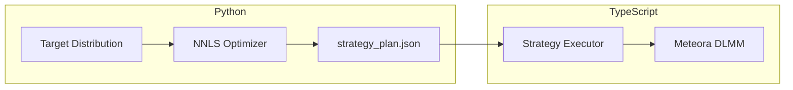

##Python-to-TypeScript Integration

### Overview

Create a bridge between the Python optimizer and TypeScript deployer:



### Step 1: Add JSON Export to Python

Add function to [src/python/templates.py](src/python/templates.py):

```python
def export_strategy_plan(result: dict, params: list, output_path: str, pool_config: dict = None):
    """Export optimization result to JSON for TypeScript deployment."""
    plan = {
        "version": "1.0",
        "generated_at": datetime.now().isoformat(),
        "metrics": {
            "r_squared": result["r_squared"],
            "residual": result["residual"]
        },
        "strategies": [
            {
                "type": strat["type"],  # "rectangle" | "curve" | "bid_ask"
                "center": strat["center"],
                "width": strat["width"],
                "weight": float(weight)
            }
            for strat, weight in result["strategies"]
        ],
        "pool_config": pool_config
    }
    with open(output_path, 'w') as f:
        json.dump(plan, f, indent=2)
```

### Step 2: Create TypeScript Strategy Executor

Create new file [src/sdk/executor.ts](src/sdk/executor.ts):

- Read JSON strategy plan
- Map Python types to Meteora StrategyType:
  - "rectangle" -> StrategyType.Spot
  - "curve" -> StrategyType.Curve  
  - "bid_ask" -> StrategyType.BidAsk
- Execute positions for each strategy with allocated amounts
- Handle multiple positions if needed

Key interface:

```typescript
interface StrategyPlan {
  version: string;
  strategies: Array<{
    type: "rectangle" | "curve" | "bid_ask";
    center: number;
    width: number;
    weight: number;
  }>;
  pool_config?: {
    poolAddress: string;
    binStep: number;
    activeBin: number;
  };
}

async function executeStrategyPlan(
  client: Client,
  plan: StrategyPlan,
  totalX: BN,
  totalY: BN
): Promise<string[]>
```

### Step 3: Add CLI for End-to-End Flow

Update Python to accept command line args:
- `--target gaussian --center 34 --sigma 12`
- `--max-strategies 3`
- `--output strategy_plan.json`

---
